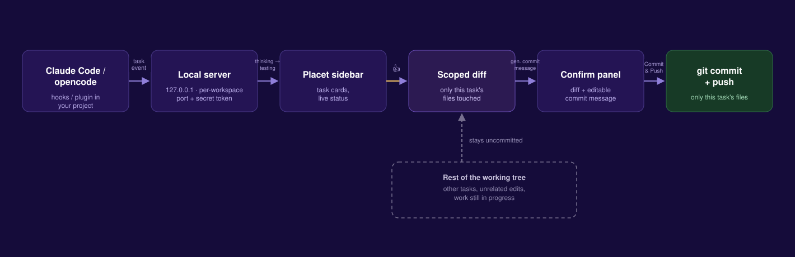
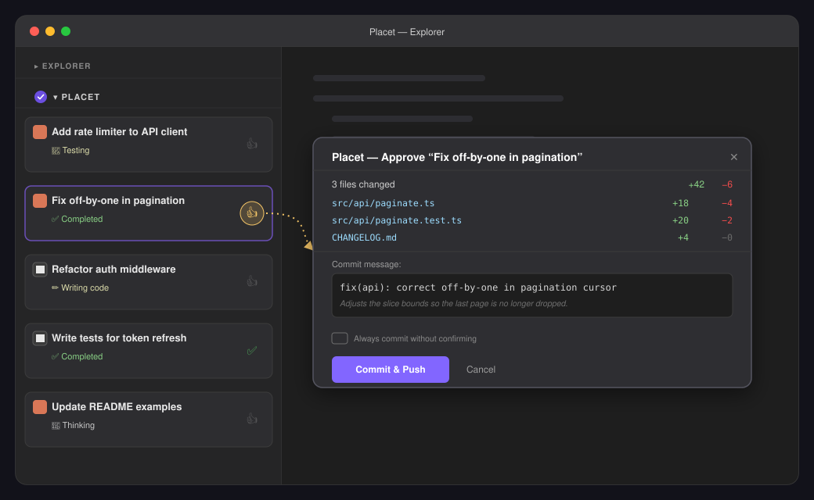

<p align="center">
  
</p>

<p align="center">
  <a href="https://marketplace.visualstudio.com/items?itemName=mattqdev.placet">
    
  </a>
  <a href="./LICENSE">
    
  </a>
</p>

Placet watches what your AI coding assistant is doing — task by task — in a
panel at the bottom of the VS Code Explorer sidebar. When a task is done and
tested, give it a 👍: Placet stages and commits **only the files that task
touched**, with a generated commit message and a push confirmation, before
anything leaves your machine.

## Why

Long agent sessions interleave several tasks — a fix here, a refactor there,
a test file somewhere else. A single `git commit -a` at the end lumps all of
it into one commit with no real story. Placet tracks each task's own
lifecycle and its own file set, so you can review and land them
independently — one clean, scoped commit per unit of work, not one giant
one at the end of the session.

## How it works

<p align="center">
  
</p>

- **Hooks / plugin** in your connected project forward task lifecycle
  events (thinking → coding → testing → completed) to a small local
  server Placet starts for that workspace — bound to `127.0.0.1`, guarded
  by a per-workspace secret token. Nothing leaves your machine.
- The **sidebar** renders those events live as task cards, one per unit of
  work, each tracking exactly which files it touched.
- **👍 approve** a card and Placet builds a diff scoped to that task's
  files only, generates a commit message, and — unless you've turned
  confirmation off — shows you both before doing anything.
- **Commit & Push** stages just those files, commits, and pushes. Every
  other change in your working tree, whether from another in-flight task
  or your own unrelated edits, is left exactly as it was.

## What it looks like

<p align="center">
  
</p>

## Install

Search for **Placet** in the VS Code Extensions view, or install from the
[Marketplace listing](https://marketplace.visualstudio.com/items?itemName=mattqdev.placet).

## Connecting an AI tool

Run one of these from the Command Palette in the connected project (not in
this repo — in whatever project you're using Claude Code / opencode on):

- **Placet: Connect Claude Code** — writes hooks into
  `.claude/settings.local.json` (personal, gitignored automatically since it
  embeds an absolute path to this install of Placet). Start a **new** Claude
  Code session afterwards — hooks are only read at session start.
- **Placet: Connect opencode** — copies a plugin to
  `.opencode/plugin/placet.ts`. No machine-specific paths, so it's fine to
  commit and share with teammates. Start a **new** opencode session
  afterwards.

## Configuration

| Setting | Default | Description |
| --- | --- | --- |
| `placet.requireConfirmation` | `true` | Ask for confirmation (with diff + commit message preview) before committing and pushing after a thumbs-up. |
| `placet.commitMessageStyle` | `conventional-commits` | Format used when generating commit messages for approved tasks (`conventional-commits` or `freeform`). |
| `placet.commitMessageMaxSubjectLength` | `72` | Maximum length requested for the generated commit message's subject line. |

## Development

```bash
npm install
npm run compile   # or: npm run watch
```

Then press F5 in VS Code (`Run Extension` launch config) to open an Extension
Development Host with Placet loaded.

Logs go to the "Placet" Output channel and to `.placet/placet.log` in the
connected workspace.

## Testing

```bash
npm test
```

Runs the automated suite (no AI provider calls). See [`TESTING.md`](./TESTING.md)
for what's covered, plus `scripts/simulate-task.js` for exercising the
sidebar UI and approve-to-commit flow without spending any tokens, and the
two minimal real-AI prompts for validating actual hook wiring.

## Status

- [x] Extension scaffold, sidebar webview panel, local event server + task store
- [x] Claude Code adapter (hooks → forwarder → local server)
- [x] opencode adapter (plugin → local server)
- [x] Approve-to-commit flow (scoped diff, confirmation panel, commit message generation, push)

## Releasing

See [`RELEASING.md`](./RELEASING.md).

## License

[MIT](./LICENSE) — provider marks for Claude Code and opencode are vendored
from [Simple Icons](https://simpleicons.org) (CC0-1.0).
